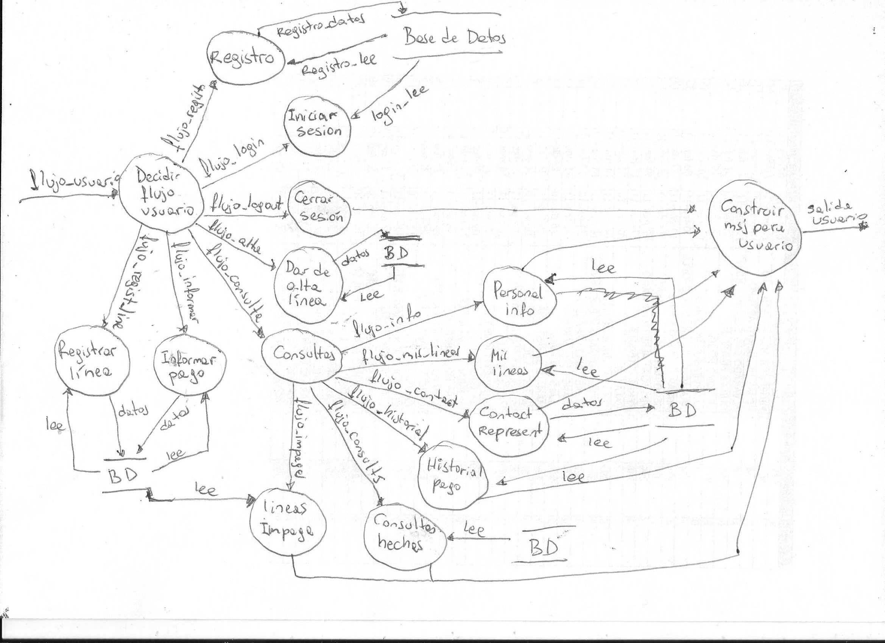
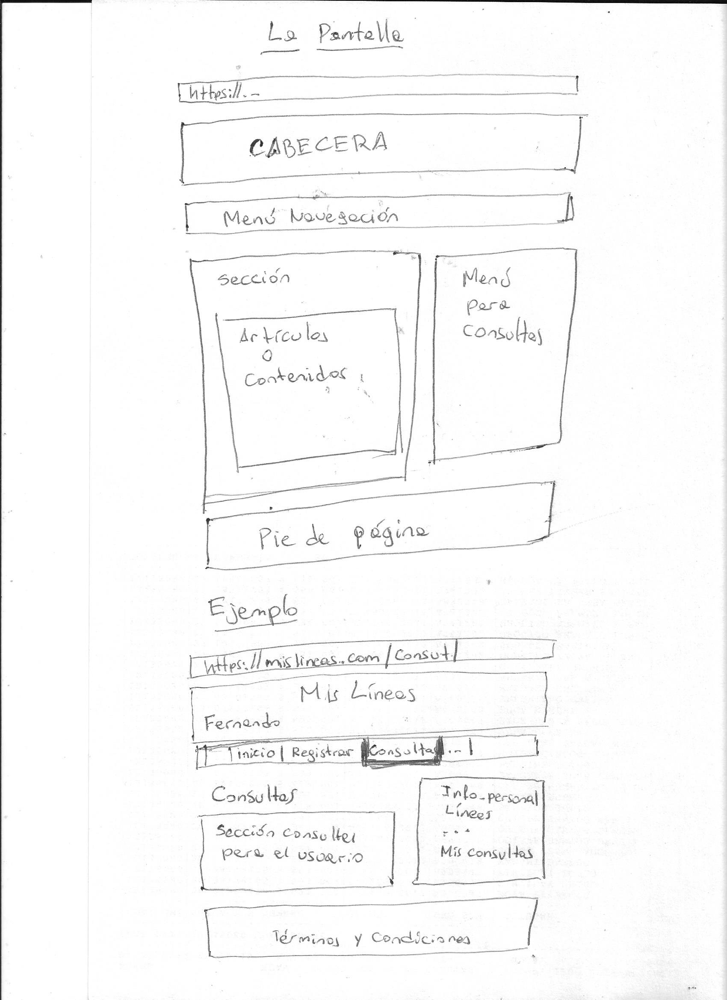
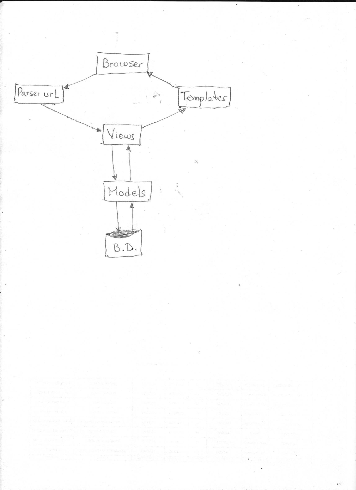
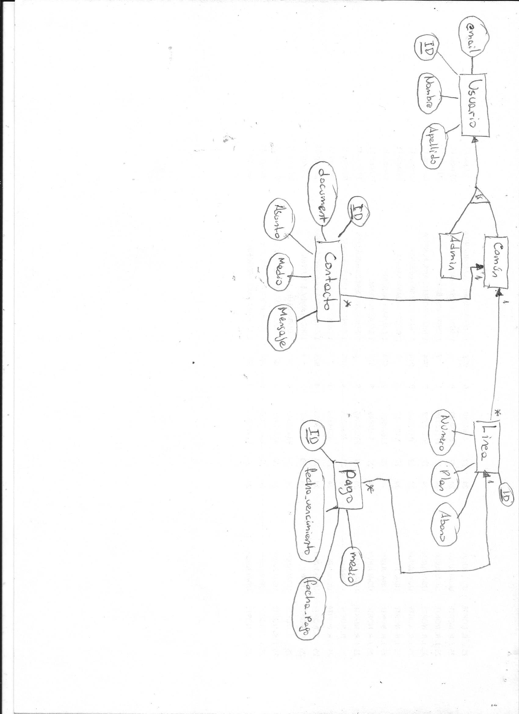
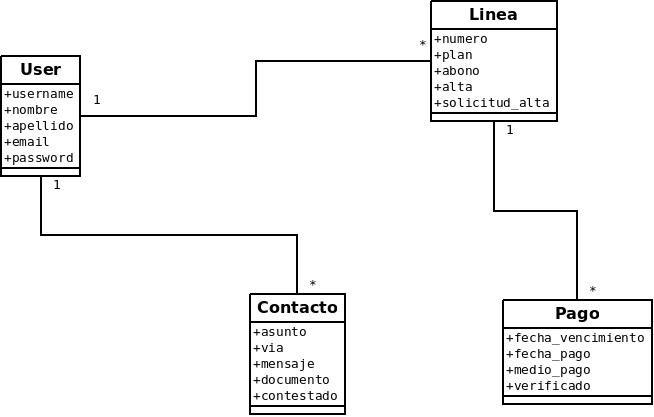
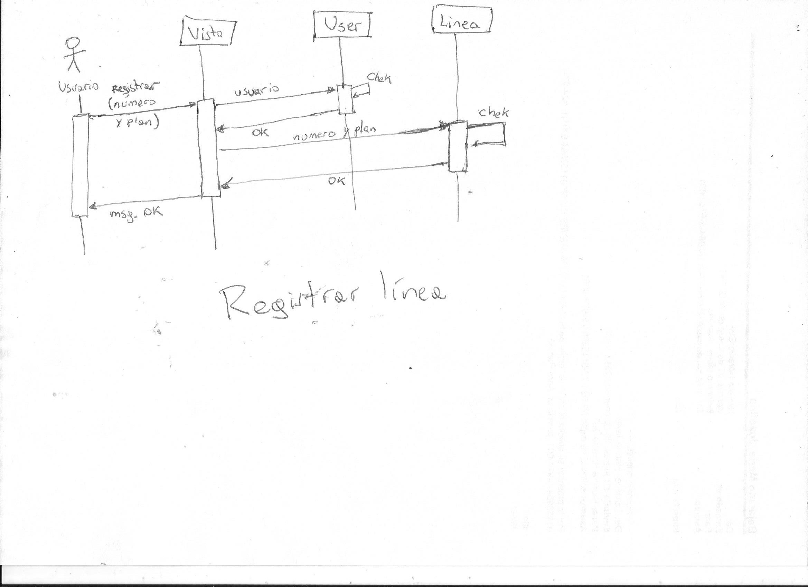

#Portal “MisLineas”

Una empresa de telefonía necesita desarrollar una aplicación que permita a sus usuarios, acceder a
información relacionada con sus líneas telefónicas.
El principal requerimiento es que la aplicación debe ser apta para usarla en ambiente web cross-browser y
mobile.

El usuario debe estar previamente registrado para poder utilizar la aplicación.
Los siguientes datos serán solicitados en el proceso de registración:

* Nombre
* Apellido
* Email
* Contraseña

En cualquier momento el usuario podrá acceder a ver su información personal
Es necesario tener una sección donde el usuario pueda ver los detalles de las líneas, historial de los pagos y
poder informar un pago.
Cuando el usuario da de alta una línea, el proceso está sujeto a verificación de que el número de línea exista
en la base de datos de la empresa. Si no existe, no se podrá dar de alta.
Se enviara un SMS para verificar que el usuario es el propietario de la línea.

## Información sobre la línea

* Número de línea
* Plan
* Abono mensual

## Información sobre los pagos

* Número de línea
* Fecha de vencimiento
* Fecha del pago
* Medio de pago

El usuario podrá contactarse con un representante sobre algún asunto en particular. También se podrá subir
documentos junto con la consulta. Se dará la opción de elegir como quiere que el representante se
comunique con él. Puede ser por email, o mediante un SMS notificando que su consulta fue contestada.

## Asuntos sugeridos

* Pago realizado
* Cambio de abono
* Actualización de datos
* Otros

Se podrá visualizar el estado de todas las consultas realizadas y el detalle de cada una.
Los Términos y Condiciones del uso de la aplicación, deben estar disponibles en todo momento


# Descripción detallada del problema

Se desea realizar un sistema que administre las líneas de sus usuarios.
Los objectivos son los siguientes:

## Alta

Una persona se podrá dar de alta en el sistema proporcionando sus datos personales:
* Número de linea.

Una persona podrá tener varias líneas dadas de alta.

Los métodos para darse de alta seran por medio de la página web.

El administrador podrá aceptar la alta o rechazarla según el caso.

## Usuario común

Para que un usuario puedar realizar cualquier operación en el sistema, debe estar registrado en el mismo.

Un usuario podrá conectarse con el sistema si éste está iniciado sesion.

Podrá consultar: su información personal, historial de pago, sus lineas registradas, sus consultas realizadas.

Podrá comunicarse con un representante por medio de un formulario web, informar un pago y registrar una línea.

## Usuario administrador

El administrador podrá ver, modificar, actualizar toda la base de datos si éste lo desee. Entre ellos podrá dar de alta una linea, ver las consultas enviadas por un usuario común, crear nuevas lineas, modificar plan, precio, un pago informado por un usuario común y eliminar cualquier linea.

# Funcionalidades para el usuario común

* Registarse
* Iniciar sesión
* Ver su información personal
* Ver sus líneas registradas
* Contactar con un representante
* Ver historial de pagos
* Ver consultas realizadas
* Informar un pago
* Solicitar dar de alta una línea
* Registrar una lìnea.

## Caso de uso #1 ...
...
## Caso dw uso #10: Registrar una línea
**Precondición:** El usuario tiene una cuenta, ha iniciado sesión y cuenta con un número otorgado por la empresa.
**Actor**: Usuario común
Este caso de uso comienza cuando el actor hizo clic en "Registrar línea".

_Escenario exitoso_:
- El sistema le muesta un formulario con un campo para que ingrese el número y otro campo para que seleccione el tipo de plan que desea tener el usuario. También le muestra un botón para confirmar tal acción.
- El usuario ingresa el número, elije un plan y dá clic en el boton "Registrar línea"
- El sistema toma el pedido de registro, lo almacena en la base de datos y lo redirecciona a la página de lineas registradas por el usuario.

_Escenario excepcional_:
- El usuario ingresa un número que no está en la base de datos del sistema.
- El sistema no almacena el número solicitado y muestra un mensaje de error.


# Respondiendo las preguntas
1- Imagen




2- Los bosquejos de pantalla siguen este patron ya que me parece muy limpia su navegación.



El diagrama de navegabilidad se muestra abajo. Eleqí este tipo de navegabilidad por su simplesa.
El usuario ingresa una url, luego es parseada y se lo pasa a Views para qué esta se encargue de pasarlo a los modelos quienes son los que se comunican con la base de datos o no, y luego se lo pasa a Template para que éste se lo envíe un archivo html en forma legible y agradable.
Me parece muy claro el flujo que tiene en este modelo.



3- La tecnológia que sugiero para implementar es en el lenguaje de programación de Python con el framework Django ya que éste sigue el patron MVT (Models, Views and Templates). Con MySQL como base de datos ya que está soportada por el framework y porque para esta aplicación va a andar sin problemas.

4- Aquí está un diagrama de Entidad-relacion con sus respectovos campos y claves primarias. Para el nombre de las tablas sería la unión de los nombres de las entidades que están relacionadas. Por ejemplo en la relacion de Usuario y Linea, el nombre sería UsuarioLinea, respetando el standard UpperCamelCase.



5- El framework de Django nos abstrae mucho de la base de datos evitando muchos problemas. Pero si tengo que elegir entre consulta a la base de datos directas o mediante procedimientos, elegiría por procedimientos, ya que consultas directas puede tener problemas de inyección.

6- Las clases que usé son estas



7- Como mencioné anteriormente usaría el patron MVT (Models, Views and Template) o como otra opción sería el MVC (Models, Views and Controller) ya que tiene una visión clara de como fluyen los datos.


8- Diagrama de flujo para el proceso de registración.



9- Estructura del proyecto:

```vim
<repositorio-proyecto>
    Readme.md
    requeriments.txt
    <doc>
    <source>
        <apps>
            <app1>
            <app2>
            ...
            <appN>
        <config>
            <archivos de configuracion>
        <media>
        <static>
            <css>
            <js>
            
        <templates>
```
